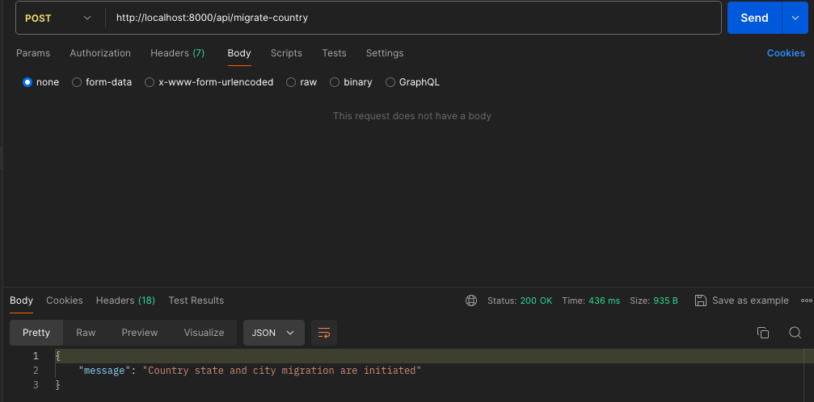
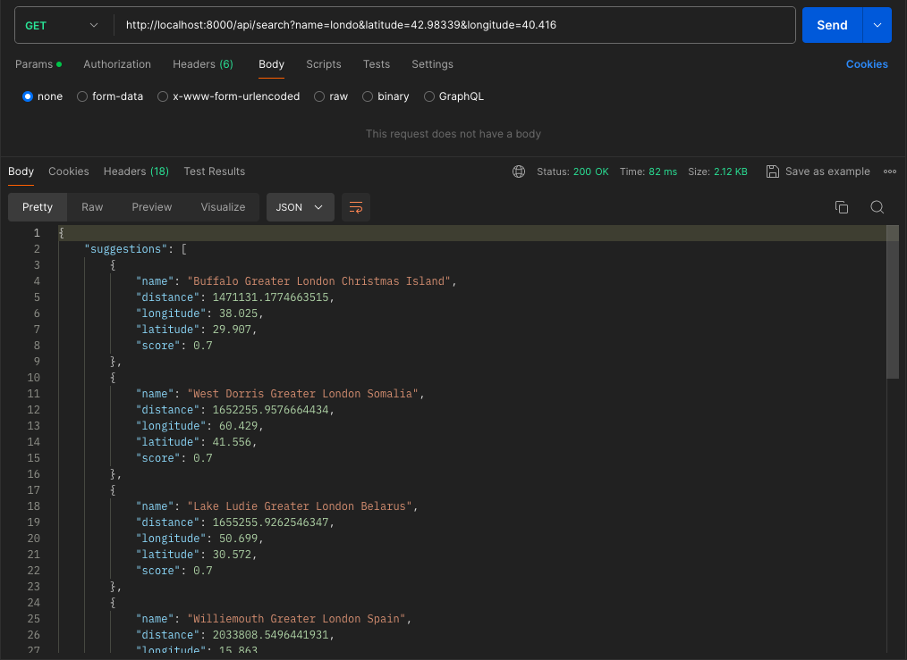
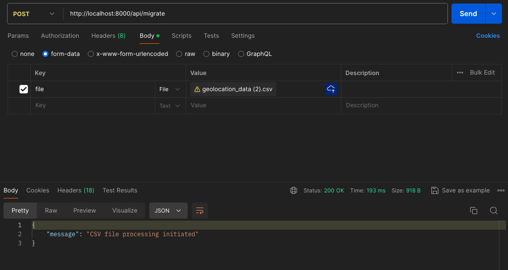

# Node.js Application README

## Introduction
This is a Node.js application designed to perform data migration and search operations. It utilizes MongoDB for data storage and retrieval, and Redis for caching purposes.

## Prerequisites
Before running the application, make sure you have the following installed:
- MongoDB
- Redis
- Node.js (v20.12.2)
- npm (v10.5.0)

## Setup
1. Start MongoDB on Terminal:
- For Mac users:
  ```
  mongod --dbpath ~/mongodb_data
  ```
- For other platforms, please refer to the official mongodb documentation for installation instructions.

2. Start Redis on Terminal:
- For Mac users:
  ```
  brew services start redis
  ```
- For other platforms, please refer to the official Redis documentation for installation instructions.

3. Install dependencies:
```
  npm install
  ```


## Running the Application
To start the application, run the following command:
 ```
  npm run start
  ```


By default, the application runs on port 8000.

## API Endpoints

1. ** Save all countries, state and cities name API:**
   - Endpoint: `/api/migrate-country`
   - HTTP request: POST
   - Description: This API endpoint saves all country, state, and city details to MongoDB. It is used to retrieve the state code of a city, which is then saved with the address information.

   
   
2. **Data Migration API:**
   - Endpoint: `/api/migrate`
   - HTTP request: POST
   - Description: This API endpoint is used to migrate data from CSV files to MongoDB.

   

3. **Search API:**
   - Endpoint: `/api/search`
   - HTTP request: GET
   - Description: This API endpoint is used to search data stored in MongoDB.

   

## Additional Notes
- Make sure MongoDB and Redis are running in the background before starting the application.
